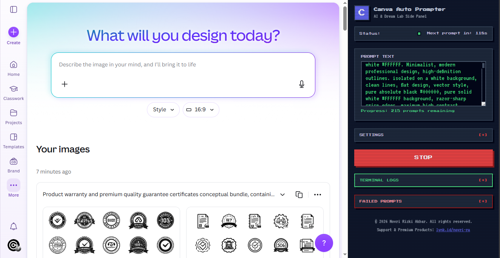

# 🤖 Canva Auto Prompter

<div align="center">
  
</div>

**_Manifest V3 Chrome Extension powered by Chrome DevTools Protocol (CDP)_**

---

## 🚀 1. Project Overview

**Canva Auto Prompter** is a God-Tier automation and bulk prompt runner engineered exclusively for **Canva Dream Lab** (`canva.com/dream-lab`). Built on the Google Chrome Manifest V3 standard, the extension wraps a robust background engine that connects directly to the Chrome DevTools Protocol (CDP) to execute hardware-level user inputs. This bypasses the virtualized synthetic event barriers common in modern React architectures.

Designed with an **"Ergonomic Midnight Arcade" 8-bit retro theme**, the panel uses slate-blue and green tones that minimize visual eye strain during long-running background sessions. The UI implements pure-CSS collapsible accordions (using the checkbox hack) to manage clutter and houses a custom, scrollable in-app terminal console displaying live, color-coded, verbose operation logs.

---

## 🏗️ 2. Architecture & Core Components

```text
├── manifest.json       # Declarative permissions, debugger rules, and Side Panel configurations
├── background.js       # The CDP Bridge & Service Worker (debugger session runner)
├── panel.html          # Front-end Side Panel ( Midnight Arcade style UI )
├── panel.js            # Frontend State Sync, Queue Controller, and UI events
└── content.js          # DOM Sniper, Automation State Machine, & Console interceptor

```

### 🌉 `background.js` (The CDP Bridge)

Attaches `chrome.debugger` to the active tab to execute commands that regular content scripts cannot perform due to security sandboxes.

* **Debugger Attachment:** Orchestrates `chrome.debugger.attach` and `detach` hooks.
* **CDP Event Router:** Translates frontend action requests (`CDP_CLICK` and `CDP_TYPE`) into protocol commands:
* `Input.dispatchMouseEvent` (simulating coordinates-based press and release).
* `Input.dispatchKeyEvent` and `Input.insertText` (inserting high-speed keyboard input).


### 🎯 `content.js` (The DOM Sniper & State Machine)

Runs directly in the context of the Canva page. It is responsible for DOM traversal, state evaluation, error recovery, and rate limit parsing.

* **DOM Sniper:** Dynamically queries custom elements, spans, and React portal inputs using robust fallback selectors and XPath expressions.
* **State Machine:** Executes a strict sequential loop (Inject -> Verify -> Submit -> Cooldown Check -> Poll -> Download -> Shift Queue).
* **Console Interceptor:** Overrides `console.log`, `console.warn`, and `console.error` to broadcast tab logs back to the side panel.

### 🎛️ `panel.html` & `panel.js` (UI & Queue Manager)

Powered by the Chrome Extensions Manifest V3 side panel API, providing a persistent, non-intrusive workspace interface.

* **Queue Manager:** Manages the prompt queue in a FIFO (First-In, First-Out) destructive manner. Shifts prompts only after verified successful generation and download, preventing data loss in the event of failure.
* **Visual Terminal logs:** Updates the customized scrollable terminal console with rich text formatting (green for info, yellow for warnings, and bold red for errors).

---

## ✨ 3. Key Features (The God-Tier Upgrades)

* **CDP Hardware-Level Input:** Traditional DOM simulation (`element.click()`, `dispatchEvent`) fails on React-controlled elements because they do not trigger React's internal fiber state updates. By routing interactions through Chrome's native debugger API, Canva receives true OS-level mouse and keyboard events.
* **Dynamic Rate Limit Handling:** When Canva displays a cooldown notification (e.g. *"Try again in 4:20"* or *"generate again in 0:45"*), `content.js` executes a RegEx scanner over the DOM. It extracts the minutes and seconds, converts it to milliseconds, adds a **5-second safety buffer**, and initiates a **live, visual countdown** ticking directly inside the Side Panel's Status bar.
* **Phantom Success & Stale-DOM Immunity:** Built-in Parallel State Machine dynamically tracks Canva's React DOM to avoid stale queries and successfully captures and downloads images even if a preemptive rate limit toast appears right after clicking submit.
* **Auto-Clear & Retype Recovery:** After surviving a rate limit cooldown, the automation engine locates the input textarea, focuses it, clears it natively by dispatching input events, retypes the prompt using CDP typing commands, and verifies the content before triggering another submission.
* **In-App Terminal Console:** Built-in console interceptor captures all console messages from the page, processes them with timestamps, prepends status tags (`[>]` for info, `[?]` for warnings, `[!]` for errors), and appends them to a formatted scrollable `div` terminal log.

---

## 🛡️ 4. Development Audit & Bug Log (The Journey)

Building a flawless automation tool for a complex React SPA like Canva required overcoming several advanced hurdles:

* **🐛 Bug 1: Canva ignoring standard DOM events.** Standard `element.click()` or `dispatchEvent` failed to trigger React's internal fiber state updates. **Solution:** Migrated the entire engine to Chrome DevTools Protocol (`Input.dispatchMouseEvent`, `Input.insertText`) for undetectable hardware-level simulation.
* **🐛 Bug 2: Account Rate Limits (Cooldowns).** **Solution:** Built a dynamic Regex time parser that extracts the exact `mm:ss` penalty from the toast notification, puts the script to sleep, and sends a live countdown to the UI instead of crashing.
* **🐛 Bug 3: Scope Reference Errors.** `ReferenceError: currentPrompt is not defined` occurred after waking up from a rate limit cooldown. **Solution:** Fixed variable scoping by lifting the `currentPrompt` declaration outside the main `try/catch` block in the loop.
* **🐛 Bug 4: Severe Eye Strain.** The initial red/brown UI theme caused visual fatigue. **Solution:** Refactored the UI into an "Ergonomic Midnight Arcade" theme (Slate blue/green) and implemented pure-CSS "Checkbox Hack" accordions to collapse Settings and Terminal Logs cleanly.
* **🐛 Bug 5: Stale DOM State (Unmounted Images).** The script successfully waited out a 5-minute cooldown but failed to download images because React unloaded off-screen elements, making the initial button count stale. **Solution:** Relocated the `initialButtonCount` query to run *inside* the retry loop, recalculating the baseline immediately before every submit click.
* **🐛 Bug 6: Phantom Success & Pre-emptive Limits.** The script abandoned successfully generated images if Canva displayed a pre-emptive cooldown toast intended for the *next* request. **Solution:** Engineered a "Unified Parallel State Machine". The script now records the toast time but continues polling for 90 seconds. If images generate, it downloads them first, and *then* serves the cooldown penalty.
* **🐛 Bug 7: Monthly Hard Limits Causing Loops.** Hitting the monthly AI quota ("You've hit your plan's monthly AI limit") caused the script to attempt infinite recovery loops or skip valid prompts. **Solution:** Engineered a Fatal Limit Detector. If the monthly limit string is detected via XPath, the script immediately throws a fatal exception, detaches the debugger cleanly, halts the automation to prevent prompt loss, and sends a native OS-level desktop notification to alert the user.

---

## 🔮 5. Future Roadmap & Synchronizations

* **🔄 Multi-Account Session Rotation:** Integration of a cookie/token storage array to automatically sign out and rotate sessions to a fresh account once a rate-limit cooldown exceeds 10 minutes.
* **📡 Dynamic Network Hooking:** Replacing DOM polling for download button detection with CDP network event interception (`Network.responseReceived`), checking for completed high-res PNG/JPG canvas assets from Canva's rendering servers.

---

## 📥 6. Installation & Usage

### ⚙️ Installation

1. Download or clone this repository to your local system.
2. Open Google Chrome and navigate to `chrome://extensions/`.
3. Enable **Developer Mode** using the switch in the top-right corner.
4. Click **Load unpacked** in the top-left and select this project directory.

### 🕹️ Running Automation

1. Navigate to `https://www.canva.com/dream-lab`.
2. Click the **Canva Auto Prompter** icon in your extension toolbar to open the Side Panel.
3. Paste your prompt list (one prompt per line) in the textarea.
4. Set your desired **Aspect Ratio**, **Image Style**, and **Download Count**.
5. Click **Run**.

> [!WARNING]
> **The Debugger Banner:** Chrome will display a yellow banner stating: *""Canva Auto Prompter" started debugging this browser"*. **DO NOT close or dismiss this banner.** Closing the banner detaches the debugger, instantly killing the automation process.

---

## ⚠️ 7. Disclaimer & Liability

This software is developed strictly for **educational and research purposes**. Automating platforms like Canva can be a violation of their **Terms of Service**. The developer assumes absolutely **no liability** for any account bans, suspensions, resource limitations, or data loss resulting from the use of this tool. Use responsibly and at your own discretion.
